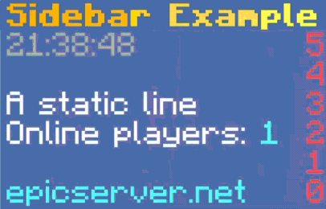

# scoreboard-library

Powerful scoreboard library for Minecraft Paper/Spigot servers using
the [adventure](https://github.com/KyoriPowered/adventure)
component library

Join the [Discord](https://discord.gg/v7nmTDTW8W) or create an issue for support

## Features

- Sidebars. Up to 42 characters (depends on the formatting) for 1.12.2 and below, no limit for newer versions
- Teams. Supports showing different properties (display name, prefix, entries etc.) of the same team to different
  players
- Objectives.
- Doesn't require extra dependencies (assuming you're targeting modern versions of Paper)
- Packet-level, meaning it works with other scoreboard plugins
- Supports [Folia](https://github.com/PaperMC/Folia)
- Fully async. All packet work is done asynchronously, so you can use the library from the main
  thread without sacrificing any performance
- Automatically works with `TranslatableComponent`s. All components are translated using `GlobalTranslator` for
  each player's client locale and automatically update whenever the player changes it in their settings

## Available Packet Adapters

- **modern.** Supports 1.17-1.20.4. Can take advantage of [Paper](https://papermc.io)'s native adventure support to be more efficient.
- **PacketEvents.** Supports 1.8+. Requires [PacketEvents 2.0](https://github.com/retrooper/packetevents/tree/2.0) to be shaded or installed as a plugin. Can be less stable than ProtocolLib.
- **1.8.8.**

> [!NOTE]  
> You can add multiple packet adapters, the best one will automatically be picked depending on the server version.

## Installation

See installation instructions [here](https://github.com/MegavexNetwork/scoreboard-library/blob/dev/2.0/INSTALLATION.md)

### Getting started

```java
ScoreboardLibrary scoreboardLibrary;
try {
  scoreboardLibrary = ScoreboardLibrary.loadScoreboardLibrary(plugin);
} catch (NoPacketAdapterAvailableException e) {
  // If no packet adapter was found, you can fallback to the no-op implementation:
  scoreboardLibrary = new NoopScoreboardLibrary();
  plugin.getLogger().warning("No scoreboard packet adapter available!");
}

// On plugin shutdown:
scoreboardLibrary.close();
```

### Thread safety warning (Folia)

`Sidebar`s and `TeamManager`s are not thread safe, so you will need to add some
synchronisation to make sure you're using them from only one thread at a time.

### Sidebar (low-level)

```java
Sidebar sidebar = scoreboardLibrary.createSidebar();

sidebar.title(Component.text("Sidebar Title"));
sidebar.line(0, Component.empty());
sidebar.line(1, Component.text("Line 1"));
sidebar.line(2, Component.text("Line 2"));
sidebar.line(2, Component.empty());
sidebar.line(3, Component.text("epicserver.net"));

sidebar.addPlayer(player); // Add the player to the sidebar

// After you've finished using the Sidebar, make sure to close it to prevent a memory leak:
sidebar.close();
```

### Component sidebars

Component sidebars are an abstraction over the low-level `Sidebar`. They allow you to design sidebars in a clean way.
Here's how you create a `SidebarComponent` with a static line:

```java
SidebarComponent staticLine = SidebarComponent.staticLine(Component.text("A static line"));
```

You can chain multiple `SidebarComponent`s together using `SidebarComponent.builder()`:

```java
SidebarComponent lines = SidebarComponent.builder()
  .addComponent(SidebarComponent.staticLine(Component.text("A static line")))
  .addStaticLine(Component.text("Another static line")) // Shorthand for line above
  .build();
```

To use these components, create a `ComponentSidebarLayout`:

```java
ComponentSidebarLayout layout = new ComponentSidebarLayout(
  SidebarComponent.staticLine(Component.text("Sidebar Title")),
  lines
);

Sidebar sidebar = scoreboardLibrary.createSidebar();

// Apply the title & lines components to the Sidebar
// Do this every time the title or any line needs to be updated
layout.apply(sidebar);
```

You can make animations with `SidebarAnimation`:

```java
Component lineComponent = Component.text("Line that changes colors");
Set<NamedTextColor> colors = NamedTextColor.NAMES.values();
List<Component> frames = new ArrayList<>(colors.size());
for (NamedTextColor color : colors) {
  frames.add(lineComponent.color(color));
}

SidebarAnimation<Component> animation = new CollectionSidebarAnimation<>(frames);
// You can also implement SidebarAnimation yourself

SidebarComponent line = SidebarComponent.animatedLine(animation);

// Advance to the next frame of the animation
animation.nextFrame();
```

Animations can be used for pagination:

```java
Player player = ...;

SidebarComponent firstPage = SidebarComponent.builder()
  .addStaticLine(Component.text("First page"))
  .addDynamicLine(() -> Component.text("Level: " + player.getLevel()))
  .build();

SidebarComponent secondPage = SidebarComponent.builder()
  .addStaticLine(Component.text("Second page"))
  .addDynamicLine(() -> Component.text("Health: " + player.getHealth()))
  .build();

List<SidebarComponent> pages = Arrays.asList(firstPage, secondPage);
SidebarAnimation<SidebarComponent> pageAnimation = new CollectionSidebarAnimation<>(pages);
SidebarComponent paginatedComponent = SidebarComponent.animatedComponent(pageAnimation);

// ...
```

You can also create your own `SidebarComponent`s:

```java
public class KeyValueSidebarComponent implements SidebarComponent {
  private final Component key;
  private final Supplier<Component> valueSupplier;

  public KeyValueSidebarComponent(@NotNull Component key, @NotNull Supplier<Component> valueSupplier) {
    this.key = key;
    this.valueSupplier = valueSupplier;
  }

  @Override
  public void draw(@NotNull LineDrawable drawable) {
    var value = valueSupplier.get();
    var line = Component.text()
      .append(key)
      .append(Component.text(": "))
      .append(value.colorIfAbsent(NamedTextColor.AQUA))
      .build();

    drawable.drawLine(line);
  }
}
```

Here's a full sidebar example:

```java
public class ExampleComponentSidebar {
  private final Sidebar sidebar;
  private final ComponentSidebarLayout componentSidebar;
  private final SidebarAnimation<Component> titleAnimation;

  public ExampleComponentSidebar(@NotNull Plugin plugin, @NotNull Sidebar sidebar) {
    this.sidebar = sidebar;

    this.titleAnimation = createGradientAnimation(Component.text("Sidebar Example", Style.style(TextDecoration.BOLD)));
    var title = SidebarComponent.animatedLine(titleAnimation);

    SimpleDateFormat dtf = new SimpleDateFormat("HH:mm:ss");

    // Custom SidebarComponent, see below for how an implementation might look like
    SidebarComponent onlinePlayers = new KeyValueSidebarComponent(
      Component.text("Online players"),
      () -> Component.text(plugin.getServer().getOnlinePlayers().size())
    );

    SidebarComponent lines = SidebarComponent.builder()
      .addDynamicLine(() -> {
        var time = dtf.format(new Date());
        return Component.text(time, NamedTextColor.GRAY);
      })
      .addBlankLine()
      .addStaticLine(Component.text("A static line"))
      .addComponent(onlinePlayers)
      .addBlankLine()
      .addStaticLine(Component.text("epicserver.net", NamedTextColor.AQUA))
      .build();


    this.componentSidebar = new ComponentSidebarLayout(title, lines);
  }

  // Called every tick
  public void tick() {
    // Advance title animation to the next frame
    titleAnimation.nextFrame();

    // Update sidebar title & lines
    componentSidebar.apply(sidebar);
  }

  private @NotNull SidebarAnimation<Component> createGradientAnimation(@NotNull Component text) {
    float step = 1f / 8f;

    TagResolver.Single textPlaceholder = Placeholder.component("text", text);
    List<Component> frames = new ArrayList<>((int) (2f / step));

    float phase = -1f;
    while (phase < 1) {
      frames.add(MiniMessage.miniMessage().deserialize("<gradient:yellow:gold:" + phase + "><text>", textPlaceholder));
      phase += step;
    }

    return new CollectionSidebarAnimation<>(frames);
  }
}
```

`

### TeamManager

```java
TeamManager teamManager = scoreboardLibrary.createTeamManager();
ScoreboardTeam team = teamManager.createIfAbsent("team_name");

// A TeamDisplay holds all the display properties that a team can have (prefix, suffix etc.).
// You can apply different TeamDisplays for each player so different players can see
// different properties on a single ScoreboardTeam. However if you don't need that you can
// use the default TeamDisplay that is created in every ScoreboardTeam.
TeamDisplay teamDisplay = team.defaultDisplay();
teamDisplay.displayName(Component.text("Team Display Name"));
teamDisplay.prefix(Component.text("[Prefix] "));
teamDisplay.suffix(Component.text(" [Suffix]"));
teamDisplay.playerColor(NamedTextColor.RED);
teamDisplay.addEntry(player.getName());

teamManager.addPlayer(player); // Player will be added to the default TeamDisplay of each ScoreboardTeam

// Create a new TeamDisplay like this:
TeamDisplay newTeamDisplay = team.createDisplay();
newTeamDisplay.displayName(Component.text("Other Team Display Name"));

// Change the TeamDisplay a player sees like this:
team.display(player, newTeamDisplay);

// After you've finished using the TeamManager, make sure to close it to prevent a memory leak:
teamManager.close();
```

### ObjectiveManager

```java
ObjectiveManager objectiveManager = scoreboardLibrary.createObjectiveManager();
ScoreboardObjective objective = objectiveManager.create("coolobjective");
objective.value(Component.text("Display name"));
objective.score(player.getName(), 69420);
objectiveManager.display(ObjectiveDisplaySlot.belowName(), objective);

objectiveManager.addPlayer(player); // Make a player see the objectives

// After you've finished using the ObjectiveManager, make sure to close it to prevent a memory leak:
objectiveManager.close();
```
